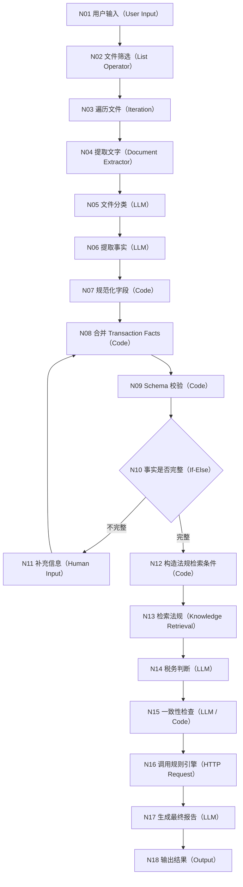

# Dify Workflow 技术规划 v0.1

## 一、应用类型

第一版使用 Dify Workflow。

目标：

- 接收合同及相关交易材料
- 提取结构化事实
- 检索适用法规
- 调用 Python 规则引擎
- 输出税务健康报告

本文件是技术规划，不是正式导出的 Dify DSL。

## 二、Dify Workflow 技术草图



## 三、技术节点清单

| ID | 节点名称 | Dify 节点类型 | 主要输入 | 主要输出 |
|---|---|---|---|---|
| N01 | 用户输入 | User Input | `tax_case_id`、`files`、用户补充说明 | 原始文件列表 |
| N02 | 文件筛选 | List Operator | 原始文件列表 | 支持处理的文件 |
| N03 | 遍历文件 | Iteration | 文件数组 | 单个文件 |
| N04 | 提取文字 | Document Extractor | PDF、DOCX 等文件 | `document_text` |
| N05 | 文件分类 | LLM | 文件名、文件类型、文件文字 | `file_type` |
| N06 | 提取事实 | LLM | `file_type`、`document_text` | Contract、Actual、Evidence Facts |
| N07 | 规范化字段 | Code | LLM 提取结果 | 规范日期、枚举和金额 |
| N08 | 合并交易事实 | Code | 三类事实和用户补充信息 | `transaction_facts` |
| N09 | Schema 校验 | Code | `transaction_facts` | 校验结果和缺失字段 |
| N10 | 判断事实完整性 | If-Else | 校验结果 | 完整或缺失分支 |
| N11 | 补充信息 | Human Input | 缺失字段清单 | 用户补充事实 |
| N12 | 构造法规检索条件 | Code | Transaction Facts | Temporal RAG 查询条件 |
| N13 | 法规检索 | Knowledge Retrieval | 查询条件、法规 Metadata | `regulation_result` |
| N14 | 税务判断 | LLM | 交易事实和适用法规 | `tax_judgement` |
| N15 | 一致性检查 | LLM / Code | 合同、实际履约、税务义务 | `consistency_check` |
| N16 | 调用规则引擎 | HTTP Request | Rule Engine Input | 健康分、证据完整度、风险代码 |
| N17 | 生成最终报告 | LLM | 上游全部结构化结果 | `final_report` |
| N18 | 输出结果 | Output | 最终报告和评分结果 | 用户可查看的报告 |

## 四、外部服务

### DeepSeek API

用于以下节点：

- N05 文件分类
- N06 事实提取
- N14 税务判断
- N15 一致性检查中的语义判断
- N17 最终报告生成

开发模型：

```text
deepseek-v4-flash
```

### 法规知识库

由同学 B 准备法规内容和 Metadata。

Dify 中通过：

```text
Knowledge Retrieval
```

节点调用。

### Python Rule Engine

由同学 A 提供评分规则，同学 C 负责代码实现。

Dify 通过：

```text
HTTP Request
```

节点调用规则引擎 API。

## 五、统一错误格式

所有节点发生错误时统一输出：

```json
{
  "success": false,
  "error_code": "",
  "error_message": "",
  "failed_stage": ""
}
```

## 六、职责边界

- 同学 A：提供事实字段业务含义、Prompt 和评分规则。
- 同学 B：提供法规、Metadata、时间适用规则和一致性规则。
- 同学 C：建立 Dify 节点、配置变量、实现 Schema 校验、连接 API 并维护版本。
- LLM 不允许修改规则引擎输出的健康分、证据完整度和风险等级。

## 七、后续版本

正式在 Dify 中搭建后，应导出为：

```text
workflow_v0_5.yml
workflow_v1_0.yml
```

API Key、知识库实际内容和用户上传文件不得写入或上传到 Git。