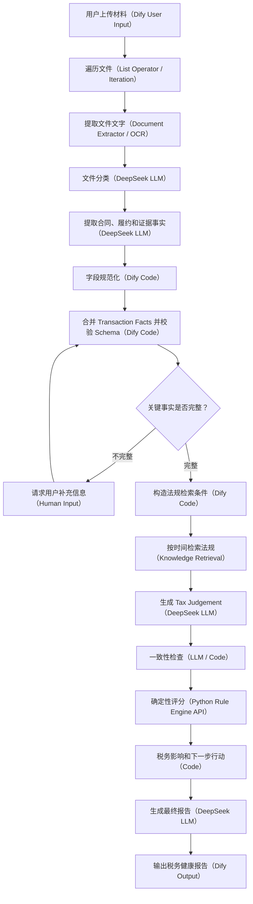

# Tax Agent 技术节点图

## 技术边界

- DeepSeek LLM：理解文件、提取事实、形成税务判断和解释报告。
- Dify Code：整理字段、合并 JSON、校验 Schema 和构造检索条件。
- Knowledge Retrieval：根据交易时间和业务类型检索法规。
- Python Rule Engine：计算健康分、证据完整度和风险等级。
- LLM 不得修改 Python Rule Engine 已经计算出的分数。